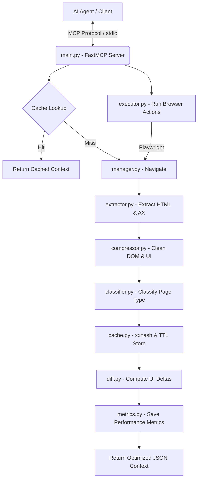

# Browser Optimizer MCP

[](https://opensource.org/licenses/MIT)
[](https://www.python.org/)
[](https://playwright.dev/)

An advanced **Model Context Protocol (MCP)** server that serves as an optimization middleware layer between AI agents (LLMs) and browser automation frameworks (Playwright). 

Directly feeding raw DOM trees or high-resolution screenshots to LLMs consumes massive amounts of tokens, raises inference latency, and causes high credit consumption. **Browser Optimizer MCP** solves this by cleaning, compressing, and structuring the page context—reducing transmitted browser context sizes by **80% to 95%** while retaining critical interactive features.

---

## 🏗️ Architecture Workflow



---

## ✨ Key Features

* **Context Compression**: Strips styles, scripts, headers, footers, SVGs, and empty DOM elements. Extracts only actionable elements (`input`, `button`, `select`, `a`, etc.) alongside a clean ARIA snapshot tree.
* **State Difference Engine**: Calculates deltas (added/removed elements) between successive page observations, ensuring the LLM is only fed incremental modifications.
* **Rule-Based Task Classifier**: Auto-categorizes pages (e.g. login, product search, checkout, surveys, dashboards) using local, token-free, high-speed heuristics.
* **Structural Cache**: Uses fast `xxhash` fingerprints and in-memory TTL caching to recall page contexts instantly without reloading.
* **Action Executor**: Processes standard navigation and interaction playbooks (`click`, `type`, `select`, `scroll`, `wait`) directly using Playwright.
* **Observability & Metrics**: Collects aggregate statistics on context size savings, cache hit ratios, and latency.

---

## 📦 Directory Structure

```text
├── app/
│   ├── browser/       # Playwright browser manager & navigation
│   ├── classifier/    # Heuristics-based page classifier
│   ├── compressor/    # DOM element optimizer and cleaner
│   ├── config/        # Environment configurations loader
│   ├── extractor/     # DOM & ARIA snapshot extraction
│   ├── schemas/       # Typed Pydantic data models
│   ├── server/        # FastMCP Server with registered tools
│   └── utils/         # Logger and shared helpers
├── docker/            # Dockerfile and docker-compose configurations
├── scripts/           # Performance benchmark suite and utilities
├── tests/             # Unit and integration test suite
├── .env               # Local configuration parameters
├── requirements.txt   # Python dependencies manifest
└── LICENSE            # MIT license info
```

---

## 🚀 Local Setup

### Prerequisites
* Python 3.11 or newer installed.
* PowerShell or Bash terminal.

### 1. Install Dependencies
```bash
# Clone the repository
git clone https://github.com/yourusername/browser-optimizer-mcp.git
cd browser-optimizer-mcp

# Create and activate virtual environment
python -m venv venv
source venv/bin/activate  # On macOS/Linux
venv\Scripts\activate     # On Windows

# Install libraries
pip install -r requirements.txt

# Install Playwright browsers and dependencies
playwright install chromium
```

### 2. Configure Environment
Create a `.env` file in the project root:
```env
LOG_LEVEL=INFO
HEADLESS=True
CACHE_ENABLED=True
CACHE_TTL=300
CACHE_MAX_SIZE=100
BROWSER_TIMEOUT=30000
```

---

## 🛠️ MCP Tools Reference

The server registers and exposes the following tools:

| Tool | Parameters | Return Type | Description |
| :--- | :--- | :--- | :--- |
| `extract_context` | `url` (string) | `CompressedContext` | Navigates to a URL, performs cleanup and compression, runs page classification, and returns optimized UI and ARIA trees. |
| `page_diff` | `url` (string) | `PageDiff` | Returns deltas (added/removed elements) compared to the last observed state of this URL. |
| `execute_action` | `action` (string), `selector` (optional), `value` (optional) | `ActionResult` | Executes standard interactions (`click`, `type`, `select`, `scroll`, `wait`, `navigate`) on the active page. |
| `summarize_page` | `url` (string) | `Dict` | Produces an instant text summary listing interactive element counts and text content snippets. |
| `classify_page` | `url` (string) | `ClassificationResult` | Evaluates UI elements to identify the page category (e.g. login, search, survey). |
| `wait_until_ready` | `url` (string), `timeout` (optional) | `ActionResult` | Navigates to a page and waits for browser stabilization. |
| `cache_lookup` | `url` (string) | `Dict` | Directly queries the semantic cache for stored context. |
| `get_metrics` | None | `Dict` | Retrieves telemetry (bytes saved, cache hit rate, total actions). |

---

## 🖥️ Client Configurations

### 1. Claude Desktop
Add this to your `claude_desktop_config.json` (located at `%APPDATA%\Claude\claude_desktop_config.json` on Windows or `~/Library/Application Support/Claude/claude_desktop_config.json` on macOS):

```json
{
  "mcpServers": {
    "browser-optimizer": {
      "command": "c:\\Users\\Manthan Railkar\\Desktop\\Git\\browser-optimizer-mcp\\venv\\Scripts\\python.exe",
      "args": ["-m", "app.server.main"],
      "env": {
        "PYTHONPATH": "c:\\Users\\Manthan Railkar\\Desktop\\Git\\browser-optimizer-mcp"
      }
    }
  }
}
```

### 2. Cursor / Antigravity IDE
1. Go to **Settings** -> **Features** -> **MCP**.
2. Click **+ Add New MCP Server**.
3. Configure the parameters:
   * **Name**: `browser-optimizer`
   * **Type**: `command`
   * **Command**: `c:\Users\Manthan Railkar\Desktop\Git\browser-optimizer-mcp\venv\Scripts\python.exe -m app.server.main`
4. Set the environment variable `PYTHONPATH` = `c:\Users\Manthan Railkar\Desktop\Git\browser-optimizer-mcp`.

---

## 📊 Run Benchmarks

Run the built-in benchmark suite to measure the exact context size reduction on live public pages:

```powershell
# Set PYTHONPATH and execute
$env:PYTHONPATH="."
venv/Scripts/python scripts/benchmark.py
```

---

## 🧪 Running Tests

Ensure all core services are operating correctly using `pytest`:

```bash
pytest tests/ -v
```

---

## 🐳 Container Deployment

Deploy using Docker Compose:

```bash
# Build and run container in detached mode
docker compose -f docker/docker-compose.yml up --build -d
```

---

## 📄 License

Distributed under the MIT License. See [LICENSE](file:///c:/Users/Manthan%20Railkar/Desktop/Git/browser-optimizer-mcp/LICENSE) for more information.
Copyright (c) 2026 Manthan.
