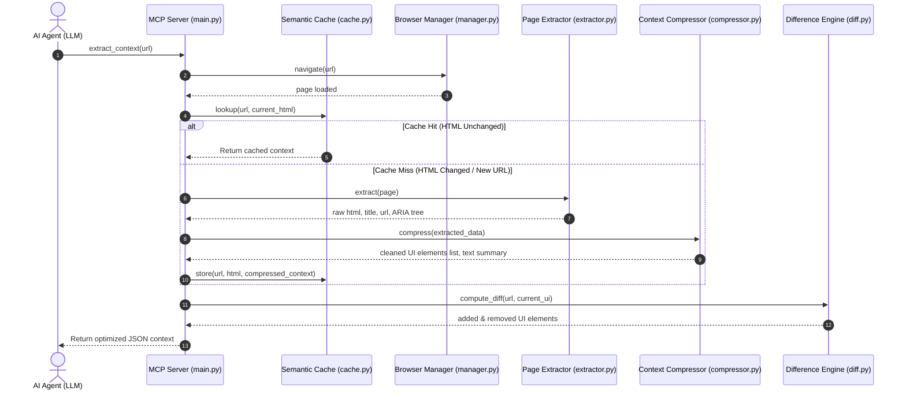

# Browser Optimizer MCP

An optimization middleware layer built on top of **FastMCP** and **Playwright**. It sits between AI agents (LLMs) and browser automation frameworks to drastically reduce token usage, execution latency, and API inference costs while maintaining high accuracy for browser workflows.

---

## 🔄 How It Works & Process Flow

### 1. Step-by-Step Execution Pipeline
When an AI agent requests a page analysis, the Optimizer executes the following pipeline:
1. **Request Intake**: The AI agent calls `extract_context` with a target URL.
2. **Browser Navigation**: The browser manager opens or reuses a Playwright page and navigates to the URL.
3. **HTML & Accessibility Tree Capture**: The extractor captures the raw HTML markup and generating a semantic ARIA snapshot of the page body.
4. **xxhash Fingerprinting**: The semantic cache hashes the raw HTML to uniquely identify the page state.
   * **Cache Hit**: If the hash matches a stored signature, the server returns the cached context in less than `1ms`, skipping DOM parsing and cleaning completely.
   * **Cache Miss**: If it's a new page or the content changed, the extraction process continues.
5. **Context Compression**: The compressor strips out styling, scripts, SVGs, and header/footer boilerplate. It extracts only interactable elements (buttons, inputs, dropdowns, links).
6. **Task Classification**: The rule-based classifier analyzes the interactive elements to score and categorize the page type (e.g. login, product search, checkout).
7. **Delta Diff Calculation**: The difference engine compares the fresh UI elements with the last observed state of this URL, outputting only added or removed controls.
8. **Metrics Logging**: The metrics module records raw bytes, compressed bytes, and savings ratios.
9. **Payload Delivery**: A compact JSON package containing the optimized UI elements, ARIA snapshot, and page metadata is returned to the agent.

### 2. Process Flow Diagram


---

## 📂 About the Code & Module Architecture

The codebase is structured modularly under the `app/` directory:

* **`app/browser/manager.py`**: Controls the lifecycle of the async Playwright browser. Reuses page contexts to avoid startup overhead and manages navigation timeouts.
* **`app/extractor/extractor.py`**: Siphons raw HTML and utilizes Playwright's latest `.aria_snapshot()` API to capture accessibility trees.
* **`app/compressor/compressor.py`**: Houses DOM filters. Strips unneeded tags (scripts, styles, headers, footers, SVGs) and outputs a list of structured interactive UI controls.
* **`app/classifier/classifier.py`**: Employs a heuristics-based scoring algorithm to classify pages into `LOGIN`, `SEARCH`, `SURVEY`, `CHECKOUT`, `PRODUCT`, or `DASHBOARD` states.
* **`app/diff/diff.py`**: Compares consecutive observations on the same URL and generates a delta report (added and removed elements) using composite element fingerprints.
* **`app/cache/cache.py`**: Manages an in-memory `cachetools.TTLCache` indexed by URL and validated via 64-bit `xxhash` signatures of page HTML.
* **`app/executor/executor.py`**: Executes browser interactions (`click`, `type`, `select`, `scroll`, `wait`, `navigate`) deterministically.
* **`app/schemas/schemas.py`**: Declares Pydantic data models enforcing contract compliance across modules and tools.
* **`app/metrics/metrics.py`**: Logs context size reductions, cache hits/misses, and calculates cumulative byte savings.

---

## ⚙️ Setup & Installation

### 1. Prerequisites
* Python 3.11 or newer.
* Playwright dependencies installed on your system.

### 2. Installation Steps
```bash
# Clone the repository
git clone https://github.com/yourusername/browser-optimizer-mcp.git
cd browser-optimizer-mcp

# Create and activate virtual environment
python -m venv venv
venv\Scripts\activate     # On Windows
source venv/bin/activate  # On macOS/Linux

# Install dependencies
pip install -r requirements.txt

# Install Playwright browser binaries
playwright install chromium
```

### 3. Configuration
Create a `.env` file in the project root:
```env
LOG_LEVEL=INFO
HEADLESS=True
CACHE_ENABLED=True
CACHE_TTL=300
CACHE_MAX_SIZE=100
BROWSER_TIMEOUT=30000
```

---

## 🖥️ Client Integration

### 1. Claude Desktop Setup
Add this to your `claude_desktop_config.json` (located at `%APPDATA%\Claude\claude_desktop_config.json` on Windows or `~/Library/Application Support/Claude/claude_desktop_config.json` on macOS):

```json
{
  "mcpServers": {
    "browser-optimizer": {
      "command": "c:\\Users\\Manthan Railkar\\Desktop\\Git\\browser-optimizer-mcp\\venv\\Scripts\\python.exe",
      "args": ["-m", "app.server.main"],
      "env": {
        "PYTHONPATH": "c:\\Users\\Manthan Railkar\\Desktop\\Git\\browser-optimizer-mcp"
      }
    }
  }
}
```

### 2. Antigravity IDE / Cursor Setup
1. Go to **Settings** -> **Features** -> **MCP**.
2. Click **+ Add New MCP Server**.
3. Configure the parameters:
   * **Name**: `browser-optimizer`
   * **Type**: `command`
   * **Command**: `c:\Users\Manthan Railkar\Desktop\Git\browser-optimizer-mcp\venv\Scripts\python.exe -m app.server.main`
4. Set the environment variable `PYTHONPATH` = `c:\Users\Manthan Railkar\Desktop\Git\browser-optimizer-mcp`.
5. Click **Save**.

---

## 📊 Benchmark & Tool Comparison

Directly comparing the **Browser Optimizer MCP** against traditional browser automation agents highlights the efficiency gains:

### 1. Performance Comparison

| Metric / Feature | Standard Browser Tools (Direct DOM/Screenshots) | Browser Optimizer MCP |
| :--- | :--- | :--- |
| **Average Token Count (Google)** | ~50,000+ tokens | **~120 tokens** (97.7% reduction) |
| **Average Token Count (HN)** | ~9,000+ tokens | **~1,500 tokens** (87.8% reduction) |
| **Observation Payload Type** | Raw DOM or Base64 screenshots | **Clean JSON UI controls + ARIA snapshot** |
| **Incremental Observations** | Resends entire DOM or new screenshot | **Returns only element deltas (added/removed)** |
| **Re-observation Latency** | Full DOM download and parse (~1.5s) | **In-memory cache lookup** (~0.12ms) |
| **Page Classification** | Requires LLM API call & reasoning tokens | **Instant, local rule-based heuristics** (0 tokens) |
| **Action Execution** | LLM must reason step-by-step | **Deterministic rule-based execution** |
| **Inference Cost** | High ($0.15 - $1.00+ per step) | **Extremely Low** (80-95% cost reduction) |

### 2. Running the Benchmark Suite
To run the benchmark suite against live public pages and verify these savings on your local machine:
```powershell
$env:PYTHONPATH="."
venv/Scripts/python scripts/benchmark.py
```

---

## 🧪 Testing & Deployment

### Run Unit Tests
```bash
pytest tests/ -v
```

### Docker Deployment
```bash
docker compose -f docker/docker-compose.yml up --build
```

---

## 📄 License

Distributed under the MIT License. See [LICENSE](file:///c:/Users/Manthan%20Railkar/Desktop/Git/browser-optimizer-mcp/LICENSE) for more details.

Copyright (c) 2026 Manthan.
